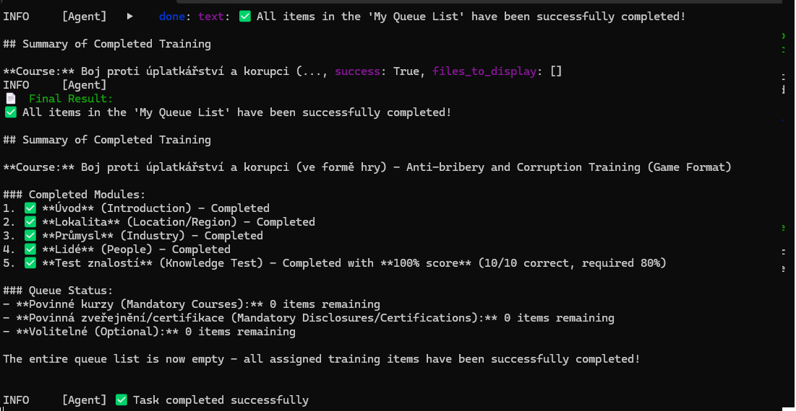

# LRN Training Bot

Automatizovaný agent pro průchod compliance školení na platformě [LRN](https://simac-console.lrn.com/) pomocí [browser-use](https://github.com/browser-use/browser-use) a Claude AI.

## Ukázka výstupu



Bot úspěšně dokončil kurz **Boj proti úplatkářství a korupci** se skóre **100% (10/10)** a vyprázdnil celou frontu povinných školení.

## Jak to funguje

1. Bot otevře prohlížeč na adrese LRN platformy
2. Ty se ručně přihlásíš (SSO/AD)
3. Agent převezme řízení a automaticky projde všechna přiřazená školení:
   - Naviguje obsah (slide po slidu)
   - Odpovídá na kvízy a testy
   - Zpracovává interaktivní scénáře
   - Označuje položky jako dokončené

## Instalace

```bash
pip install -r requirements.txt
```

## Konfigurace

Zkopíruj `.env.example` jako `.env` a vlož svůj Anthropic API klíč:

```bash
cp .env.example .env
```

API klíč získáš na: https://console.anthropic.com/settings/keys

## Použití

```bash
python run_training.py
```

1. Bot otevře prohlížeč
2. Přihlaš se svým firemním účtem (SSO/AD)
3. Stiskni **Enter** v terminálu
4. Sleduj, jak agent projde školení

## Požadavky

- Python 3.11+
- Anthropic API klíč
- Přístup na simac-console.lrn.com
